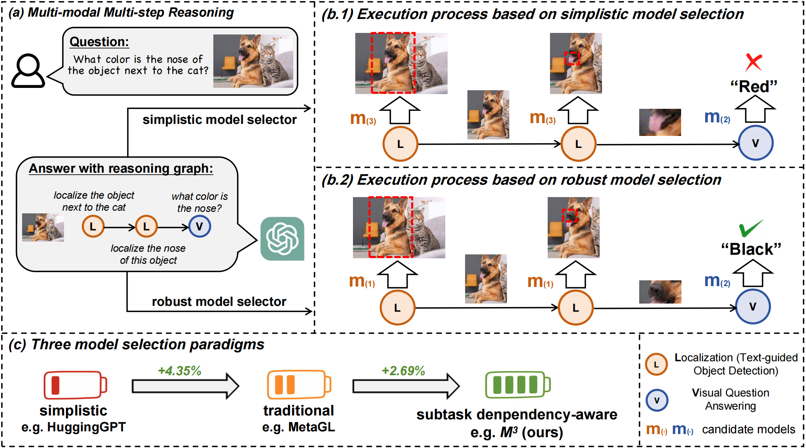

# Towards Robust Multi-Modal Reasoning via Model Selection
[Xiangyan Liu*](https://openreview.net/profile?id=~Xiangyan_Liu1), [Rongxue Li*](), [Wei Ji](https://jiwei0523.github.io/), [Tao Lin](https://tlin-taolin.github.io/)

[`arXiv`](https://arxiv.org/abs/2310.08446) | [`BibTeX`](#bibliography)

This is an official PyTorch implementation of the paper **Towards Robust Multi-modal Reasoning via Model Selection (ICLR 2024 Poster)**. In this work, we:

- formulate the model selection problem in multi-modal reasoning contexts as an initial endeavor.
- introduce $M^3$, a model selection framework for multi-modal models with multi-step reasoning, jointly modeling the relationship between samples, selected models, and subtask dependencies.
- create a comprehensive dataset called MS-GQA to facilitate the research for the community.
- provide an effective yet efficient model selection solution, with trivial test-time overhead.

## Abstract

<p align="center">

</p>

The reasoning capabilities of LLM (Large Language Model) are widely acknowledged in recent research, inspiring studies on tool learning and autonomous agents. LLM serves as the "brain" of agent, orchestrating multiple tools for collaborative multi-step task solving. Unlike methods invoking tools like calculators or weather APIs for straightforward tasks, multi-modal agents excel by integrating diverse AI models for complex challenges. However, current multi-modal agents neglect the significance of model selection: they primarily focus on the planning and execution phases, and will only invoke predefined task-specific models for each subtask, making the execution fragile. Meanwhile, other traditional model selection methods are either incompatible with or suboptimal for the multi-modal agent scenarios, due to ignorance of dependencies among subtasks arising by multi-step reasoning.

To this end, we identify the key challenges therein and propose the $M^3$ framework as a plug-in with negligible runtime overhead at test-time. This framework improves model selection and bolsters the robustness of multi-modal agents in multi-step reasoning. In the absence of suitable benchmarks, we create MS-GQA, a new dataset specifically designed to investigate the model selection challenge in multi-modal agents. Our experiments reveal that our framework enables dynamic model selection, considering both user inputs and subtask dependencies, thereby robustifying the overall reasoning process.

## Usage
### Requirements
The $M^3$ framework depends on the following main requirements:
- networkx==2.8.4
- numpy==1.23.1
- torch==1.13.1+cu117
- torch_geometric==2.3.1
- tqdm==4.64.0

If you want to run MetaGL or MetaGL++, you can use [`metagl_enviroment.sh`](https://github.com/LINs-lab/M3/blob/main/code/metagl_enviroment.sh)


### How to Run (take *MS-GQA* for example)
First, you need to download the corresponding data file from the [`Google Drive link`](https://drive.google.com/drive/folders/1aAi09tpi-skzuAxWHgGbnoqK1i7z91aM?usp=drive_link) provided and place it in the specified [`data folder`](https://github.com/LINs-lab/M3/blob/main/data). Then, you will need to run [`code/preprocess.py`](https://github.com/LINs-lab/M3/blob/main/code/preprocess.py) to preprocess the computation graph. After that, the commonly used command line for $M^3$ framework is as follows.

For simple one-time running with default hyperparameters:
```
python code/run_m3.py --backbone gat --loss cce --encoder blip --seed 1
```
For baseline NCF and NCF++:
```
## NCF
python code/run_ncf.py --loss cce --encoder blip --seed 1
## NCF++
python code/run_ncf++.py --loss cce --encoder blip --program_encoder bert --seed 1
```
For baseline MetaGL and MetaGL++:
```
## MetaGL
python code/run_metagl.py --loss cce --encoder blip --seed 1
## MetaGL++
python code/run_metagl.py --loss cce --encoder blip --seed 1 --if_add_program 1
```
For multiple complex hyper-parameter tuning experiments in $M^3$, simply do:
```
sh code/scripts/run_m3.sh
```
Note, you can freely change the range of hyperparameter values according to your needs in [`run_m3.sh`](https://github.com/LINs-lab/M3/blob/main/code/scripts/run_m3.sh).

### Benchmarks
In addition to the MS-GQA benchmark mentioned in the original paper, we have introduced a new benchmark: MS-OKVQA. This new benchmark is based on the [OKVQA](https://okvqa.allenai.org/) dataset, which contains 5,000 samples and involves two AI subtask modules: LLM (answering questions based on LLM) and VQA (Visual Question Answering). The task execution logic for MS-OKVQA is relatively straightforward, typically involving the sequential execution of an LLM subtask followed by a VQA subtask. This contrasts with the MS-GQA, which features a diverse and complex task graph. As a result, we have not explored MS-OKVQA extensively.

To facilitate future research in this area, we have made both MS-GQA and MS-OKVQA available in our codebase. However, we recommend using the more comprehensive and representative MS-GQA for those interested in following our work.

### Reproducibility
We recently found that inherent randomness in certain PyG sub-libraries causes variability in experimental results (see [link](https://github.com/pyg-team/pytorch_geometric/issues/3175)). This variation does not impact the conclusions in our paper but results in minor fluctuations. If you have better solutions, feel free to reach out anytime 👏.


<!-- ## The Benchmark for MS-GQA (TODO)
This repo also contains a separated [`codebase`](https://github.com/LINs-lab/M3/blob/main/MS-GQA/) for the benchmark MS-GQA, for the ease of reusing. -->

## Bibliography
If you find this repository helpful for your project, please consider citing our work:

```
@inproceedings{liu2024textbftextitmtextbftextit,
    title={Towards Robust Multi-Modal Reasoning via Model Selection},
    author={Xiangyan Liu and Rongxue LI and Wei Ji and Tao Lin},
    booktitle={The Twelfth International Conference on Learning Representations},
    year={2024},
    url={https://openreview.net/forum?id=KTf4DGAzus}
}
```
